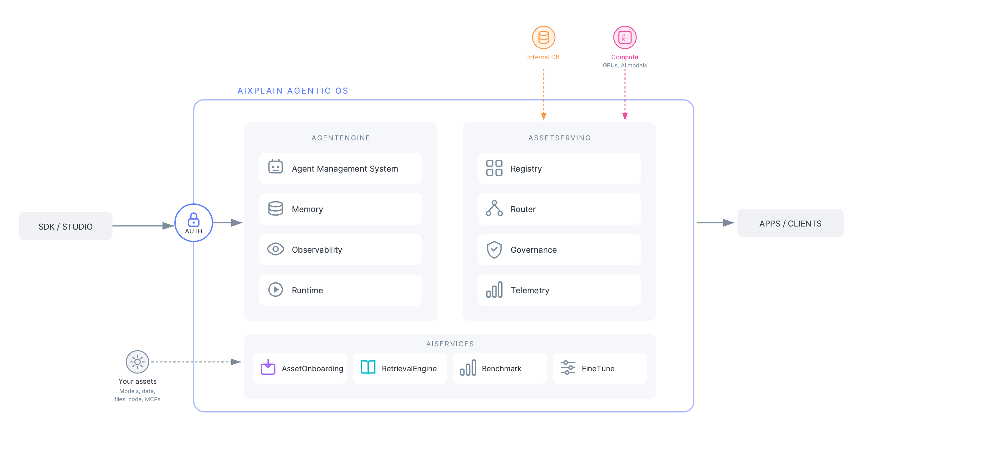

# aiXplain Agents SDK

**Build and deploy autonomous AI agents on production-grade infrastructure, instantly.**

---

## aiXplain agents

aiXplain Agents SDK gives developers Python and REST APIs to build, run, and deploy autonomous multi-step agents on [AgenticOS](https://docs.aixplain.com/getting-started/agenticos). Agents include built-in memory for short- and long-term context (opt-in), and adapt at runtime by planning steps, selecting tools and models, running code, and refining outputs until tasks are complete.

aiXplain agents include micro-agents for runtime policy enforcement and access control, plus proprietary meta-agents like Evolver for self-improvement.

With one API key, access 900+ vendor-agnostic models, tools, and integrations in the aiXplain Marketplace with consolidated billing, and swap assets without rewriting pipelines.

### Why aiXplain for developers

- **Autonomy** — agents plan and adapt at runtime instead of following fixed workflows.
- **Delegation** — route complex work to specialized subagents during execution.
- **Policy enforcement** — apply runtime guardrails with Inspector and Bodyguard on every run.
- **Observability** — inspect step-level traces, tool calls, and outcomes for debugging.
- **Portability** — swap models and tools without rewriting application logic.
- **Flexible deployment** — run the same agent definition serverless or private.

<div align="center">
  
</div>

## AgenticOS

AgenticOS is the runtime behind aiXplain Agents. It orchestrates multi-step execution, routes model and tool calls with fallback policies, enforces governance at runtime, records step-level traces, and supports both serverless and private deployment.

<div align="center">
  
</div>

---

## Quick start

```bash
pip install aixplain
```

Get your API key from your [aiXplain account](https://console.aixplain.com/settings/keys).

<details open>
  <summary><strong>v2 (default)</strong></summary>

### Create and run your first agent (v2)

```python
from aixplain import Aixplain

aix = Aixplain(api_key="<AIXPLAIN_API_KEY>")

search_tool = aix.Tool.get("tavily/tavily-web-search/tavily")

agent = aix.Agent(
    name="Research agent",
    description="Answers questions with concise web-grounded findings.",
    instructions="Use the search tool when needed and cite key findings.",
    tools=[search_tool],
)
agent.save()

result = agent.run(query="Summarize the latest AgenticOS updates.")
print(result.data.output)
```

### Build a multi-agent team (v2)

```python
from aixplain import Aixplain

aix = Aixplain(api_key="<AIXPLAIN_API_KEY>")
search_tool = aix.Tool.get("tavily/tavily-web-search/tavily")

planner = aix.Agent(
    name="Planner",
    instructions="Break requests into clear subtasks."
)

researcher = aix.Agent(
    name="Researcher",
    instructions="Find and summarize reliable sources.",
    tools=[search_tool],
)

team_agent = aix.Agent(
    name="Research team",
    instructions="Delegate work to agents, then return one final answer.",
    agents=[planner, researcher],
)
team_agent.save()

response = team_agent.run(query="Compare top open-source agent frameworks in 5 bullets.")
print(response.data.output)
```

</details>

<details>
  <summary><strong>v1 (legacy)</strong></summary>

### Create and run your first agent (v1)

```python
from aixplain.factories import AgentFactory, ModelFactory

weather_tool = ModelFactory.get("66f83c216eb563266175e201")

agent = AgentFactory.create(
    name="Weather Agent",
    description="Answers weather queries.",
    instructions="Use the weather tool to answer user questions.",
    tools=[weather_tool],
)

result = agent.run("What is the weather in Liverpool, UK?")
print(result["data"]["output"])
```

You can still access legacy docs at [docs.aixplain.com/1.0](https://docs.aixplain.com/1.0/).

</details>

---

## Data handling and deployment

aiXplain applies runtime governance and enterprise controls by default:

- **No data retained by default** — agent memory is opt-in (short-term and long-term).
- **SOC 2 Type II certified** — enterprise security and compliance posture.
- **Runtime policy enforcement** — Inspector and Bodyguard govern every agent execution.
- **Sovereign deployment options** — serverless or private (on-prem, VPC, and air-gapped).
- **Encryption** — TLS 1.2+ in transit and encrypted storage at rest.

Learn more at [aiXplain Security](https://aixplain.com/security/) and [Sovereignty](https://aixplain.com/sovereignty/).

---

## Pricing

Start free, then scale with usage-based pricing.

- **Pay as you go** — prepaid usage with no surprise overage bills.
- **Subscription plans** — reduce effective consumption-based rates.
- **Custom enterprise pricing** — available for advanced scale and deployment needs.

Learn more at [aiXplain Pricing](https://aixplain.com/pricing/).

---

## Community & support

- **Documentation:** [docs.aixplain.com](https://docs.aixplain.com)
- **Example agents**: [https://github.com/aixplain/cookbook](https://github.com/aixplain/cookbook)
- **Learn how to build agents**: [https://academy.aixplain.com/student-registration/](https://academy.aixplain.com/student-registration/)
- **Meet us in Discord:** [discord.gg/aixplain](https://discord.gg/aixplain)
- **Talk with our team:** [care@aixplain.com](mailto:care@aixplain.com)

---

## License

This project is licensed under the Apache License 2.0. See the [`LICENSE`](LICENSE) file for details.
