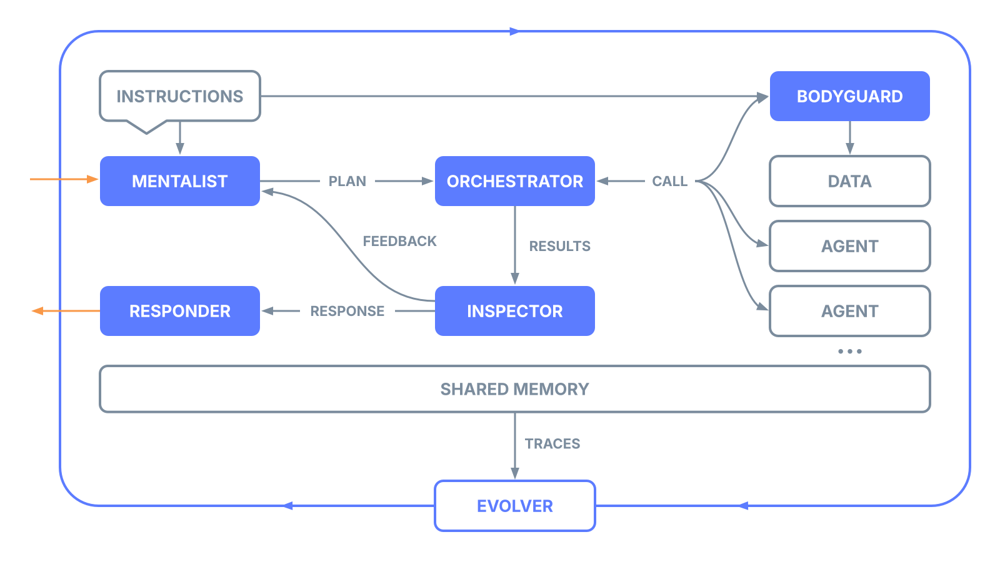
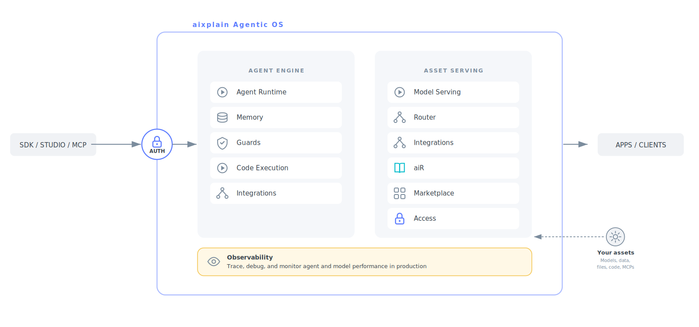

# aiXplain SDK

**aiXplain SDK lets you build autonomous AI agents that reason, use tools, delegate work, and run on portable production infrastructure.**

---

**One SDK: build, deploy, and run production AI agents.**

**You define the agent. AgenticOS runs, governs, traces, and deploys it.**

**Built for modern coding agents and IDEs.**  
Works with Claude Code, Codex, Cursor, and other coding-agent workflows.

aiXplain SDK gives you Python and REST APIs to build, run, and deploy autonomous agent software. Set your instructions, tools, and rules, and let the agent plan steps, use tools, call models and data sources, run code, and adapt until the job is done.

## Why aiXplain

- Build autonomous AI agents and multi-agent systems for real business workflows
- Govern every run with runtime policy enforcement, access control, and isolated workspaces
- Access 900+ models and tools with one API key, or bring your own model, data, code, or MCP
- Deploy instantly on AgenticOS Cloud or keep full control with AgenticOS OnPrem
- Trace and monitor agents with visual execution traces and real-time dashboards

| | aiXplain SDK | Other agent frameworks |
|---|---|---|
| Governance | Runtime policy enforcement and access control built in | Usually custom code or external guardrails |
| Models and tools | 900+ models and tools with one API key | Provider-by-provider setup |
| Deployment | AgenticOS Cloud or AgenticOS OnPrem | Usually self-assembled runtime and infra |
| Observability | Built-in traces and dashboards | Varies by framework |
| Coding-agent workflows | Works with Claude Code, Codex, Cursor, and similar tools | Usually not a first-class workflow target |

<div align="center">
  
</div>

## AgenticOS

AgenticOS is the portable runtime platform behind aiXplain agents. It is composed of three main layers: AgentEngine, AssetServing, and Observability. It handles orchestration, model and tool execution, runtime governance, and production monitoring across AgenticOS Cloud and AgenticOS OnPrem.

<div align="center">
  
</div>

---

## Quick start

```bash
pip install aixplain
```

Get your API key from your [aiXplain account](https://console.aixplain.com/settings/keys).

<details open>
  <summary><strong>v2 (default)</strong></summary>

### Create and run your first agent (v2)

```python
from uuid import uuid4
from aixplain import Aixplain

aix = Aixplain(api_key="<AIXPLAIN_API_KEY>")

search_tool = aix.Tool.get("tavily/tavily-web-search/tavily")
search_tool.allowed_actions = ["search"]

agent = aix.Agent(
    name=f"Research agent {uuid4().hex[:8]}",
    description="Answers questions with concise web-grounded findings.",
    instructions="Use the search tool when needed and cite key findings.",
    tools=[search_tool],
)
agent.save()

result = agent.run(
    query="Who is the CEO of OpenAI? Answer in one sentence.",
)
print(result.data.output)
```

### Build a multi-agent team (v2)

```python
from uuid import uuid4
from aixplain import Aixplain
from aixplain.v2 import EditorConfig, EvaluatorConfig, EvaluatorType, Inspector, InspectorAction, InspectorActionConfig, InspectorSeverity, InspectorTarget

aix = Aixplain(api_key="<AIXPLAIN_API_KEY>")
search_tool = aix.Tool.get("tavily/tavily-web-search/tavily")
search_tool.allowed_actions = ["search"]

def never_edit(text: str) -> bool:
    return False

def passthrough(text: str) -> str:
    return text

noop_inspector = Inspector(
    name=f"noop-output-inspector-{uuid4().hex[:8]}",
    severity=InspectorSeverity.LOW,
    targets=[InspectorTarget.OUTPUT],
    action=InspectorActionConfig(type=InspectorAction.EDIT),
    evaluator=EvaluatorConfig(
        type=EvaluatorType.FUNCTION,
        function=never_edit,
    ),
    editor=EditorConfig(
        type=EvaluatorType.FUNCTION,
        function=passthrough,
    ),
)

researcher = aix.Agent(
    name=f"Researcher {uuid4().hex[:8]}",
    instructions="Find and summarize reliable sources.",
    tools=[search_tool],
)

team_agent = aix.Agent(
    name=f"Research team {uuid4().hex[:8]}",
    instructions="Research the topic and return exactly 5 concise bullet points.",
    subagents=[researcher],
    inspectors=[noop_inspector],
)
team_agent.save(save_subcomponents=True)

response = team_agent.run(
    query="Compare OpenAI and Anthropic in exactly 5 concise bullet points.",
)
print(response.data.output)
```

Execution order:

```text
Human prompt: "Compare OpenAI and Anthropic in exactly 5 concise bullet points."

Team agent
├── Planner: breaks the goal into research and synthesis steps
├── Orchestrator: routes work to the right subagent
├── Researcher subagent
│   └── Tavily search tool: finds and summarizes reliable sources
├── Inspector: checks the final output through a simple runtime policy
├── Orchestrator: decides whether another pass is needed
└── Responder: returns one final answer
```
</details>

<details>
  <summary><strong>v1 (legacy)</strong></summary>

### Create and run your first agent (v1)

```python
from aixplain.factories import AgentFactory, ModelFactory

weather_tool = ModelFactory.get("66f83c216eb563266175e201")

agent = AgentFactory.create(
    name="Weather Agent",
    description="Answers weather queries.",
    instructions="Use the weather tool to answer user questions.",
    tools=[weather_tool],
)

result = agent.run("What is the weather in Liverpool, UK?")
print(result["data"]["output"])
```

You can still access legacy docs at [docs.aixplain.com/1.0](https://docs.aixplain.com/1.0/).

</details>

---

## Data handling and deployment

aiXplain applies runtime governance and enterprise controls by default:

- **We do not train on your data** — your data is not used to train foundation models.
- **No data retained by default** — agent memory is opt-in (short-term and long-term).
- **SOC 2 Type II certified** — enterprise security and compliance posture.
- **Runtime policy enforcement** — Inspector and Bodyguard govern every agent execution.
- **Portable deployment options** — AgenticOS Cloud or AgenticOS OnPrem (including VPC and air-gapped environments).
- **Encryption** — TLS 1.2+ in transit and encrypted storage at rest.

Learn more at aiXplain [Security](https://aixplain.com/security/) and aiXplain [pricing](https://aixplain.com/pricing/).

---

## Pricing

Start free, then scale with usage-based pricing.

- **Pay as you go** — prepaid usage with no surprise overage bills.
- **Subscription plans** — reduce effective consumption-based rates.
- **Custom enterprise pricing** — available for advanced scale and deployment needs.

Learn more at aiXplain [pricing](https://aixplain.com/pricing/).

---

## Community & support

- **Documentation:** [docs.aixplain.com](https://docs.aixplain.com)
- **Example agents**: [https://github.com/aixplain/cookbook](https://github.com/aixplain/cookbook)
- **Learn how to build agents**: [https://academy.aixplain.com/student-registration/](https://academy.aixplain.com/student-registration/)
- **Meet us in Discord:** [discord.gg/aixplain](https://discord.gg/aixplain)
- **Talk with our team:** [care@aixplain.com](mailto:care@aixplain.com)

---

## License

This project is licensed under the Apache License 2.0. See the [`LICENSE`](LICENSE) file for details.
