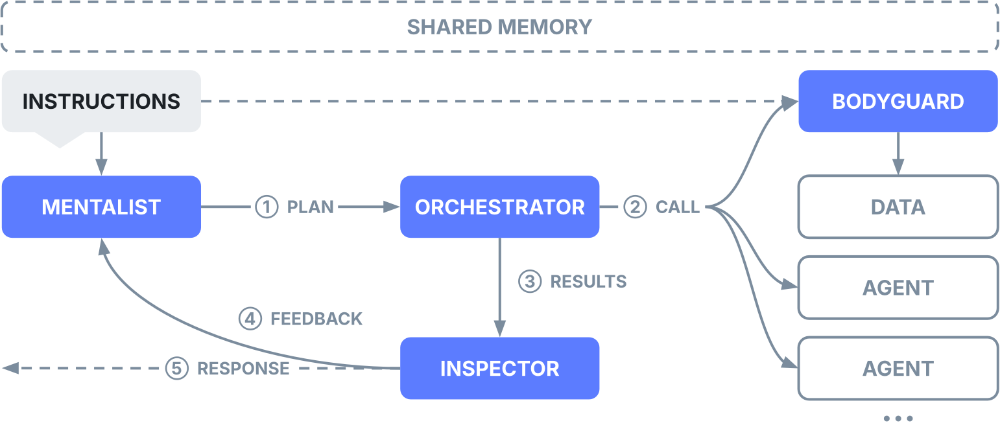

# Welcome to aiXplain

**The Agentic Operating System for Enterprise AI**

aiXplain is a full-stack platform for building, deploying, and governing mission-critical AI agents at scale. With the aiXplain SDK, you can ship production-grade agents faster:

- **Discover & connect** — Access hundreds of LLMs, tools, and integrations with a unified API, or bring your own.
- **Build & orchestrate** — Start from simple automations to **adaptive multi-agent systems** that reason, plan, and use tools, with a built-in memory.
- **Ground & retrieve** — Enhance agents with vector- and graph-based retrieval for accurate, context-aware responses.
- **Deploy anywhere** — Deploy with a click and let aiXplain handle the infrastructure (SaaS, on-prem, VPC) and MLOps so your agents can scale and evolve seamlessly.
- **Observe & improve** — Track usage and performance with tracing and audit trails, with enterprise-grade governance and compliance.

aiXplain combines developer agility with enterprise-grade reliability in a platform where data sovereignty and compliance are non-negotiable.

> Check out this benchmark: aiXplain's orchestration engine [outperforms](https://aixplain.com/blog/math-solving-agent-aixplain-vs-crewai-vs-autogen/) other agentic frameworks on complex tasks while balancing speed and cost.

---

## aiXplain agents

aiXplain agents are designed with built-in intelligence, a.k.a **microagents**, that handle the operational complexity of agents at runtime — such as planning, monitoring, validation, routing, and formatting. This frees you to focus on tuning your agents for your use case instead of rebuilding the basics.

<div align="center">
  
</div>

The diagram illustrates how the orchestration engine coordinates agents at runtime, enabling agents that are modular, traceable, and production-ready.

### Microagents

Microagents are specialized components that manage core operational functions:

- **Mentalist** — planning and goal decomposition
- **Orchestrator** — task routing and role assignment
- **Inspector** — validation and policy enforcement (e.g., PII redaction)
- **Bodyguard** — data access, privacy, and security enforcement
- **Responder** — formatting and output delivery

Microagents are highly configurable — from lightweight automations to complex, iterative systems — and appear in agent traces for easier debugging, auditing, and explainability.

### Meta-agents

Meta-agents boost adaptability by improving agent performance. The **Evolver** (in private beta) attaches to any agent, monitors KPIs and feedback, and refines behavior — also serving as a powerful benchmarking tool by simulating users and environments.

### Orchestration modes

aiXplain agents support two orchestration modes:

- **Static** — define tasks (`AgentTasks`) and order for deterministic, repeatable execution.
- **Dynamic** (default) — the **Mentalist** generates the execution plan at runtime for adaptive, context-aware responses.

aiXplain also supports [pipelines](https://docs.aixplain.com/concepts/assets/pipelines/) — sequential workflows that connect models and tools in a fixed order.

---

## How to start?

- **For technical teams** → Install the SDK and start building:

```bash
pip install aixplain
```

- **For business teams without technical resources** → [Contact aiXplain](https://aixplain.com/adaptable-ai/). Our **aiXperts** will help you develop your agentic solutions and deploy them on your choice of infrastructure.

---

## Quick start

### Installation

```
pip install aixplain
```

### Authentication

```python
import os
os.environ["AIXPLAIN_API_KEY"] = "<API_KEY>"
```

Get your API key from your [aiXplain account](https://console.aixplain.com/settings/keys).

### Create and Run Your First Agent

**Example:** A weather agent powered by the [Open Weather API](https://platform.aixplain.com/discover/model/66f83c216eb563266175e201) from the aiXplain marketplace.

By default, aiXplain agents run on [GPT-4o-mini](https://platform.aixplain.com/discover/model/669a63646eb56306647e1091) as the reasoning model. You can swap it with any other model from the aiXplain marketplace at any time.

```python
from aixplain.factories import AgentFactory, ModelFactory

# Add tools
weather_tool = ModelFactory.get("66f83c216eb563266175e201") # Tool ID for Open Weather API tools

# Create the agent
agent = AgentFactory.create(
name="Weather Agent",
description="An agent that answers queries about the current weather.",
instructions="Use the provided tool to answer weather queries.",
tools=[weather_tool],
)

# Run and test your agent
query = "What is the weather in Liverpool, UK?"
agent_response = agent.run(query)

print(agent_response['data']['output'])
```

Find a wide selection of LLMs and tools to power your agents by browsing our [marketplace](https://platform.aixplain.com/discover).

### Access your deployed agent and API integration code

Once your agent is deployed, you can view its API integration details and generated code by visiting:

[https://platform.aixplain.com/discover/agent/](https://platform.aixplain.com/discover/agent/)<AGENT_ID>

Just replace `<AGENT_ID>` in the URL with your actual agent identifier (agent.id).

### Build and deploy a Team Agent

A team agent orchestrates multiple specialized agents to solve complex problems.

```python
from aixplain.factories import TeamAgentFactory, AgentFactory
from aixplain.modules.agent.agent_task import AgentTask

# Define tasks for specialized agents
scrape_task = AgentTask(name="scrape_website", description="Scrapes websites to extract information", expected_output="Scraped website output.")

wiki_task = AgentTask(name="wiki_query", description="Queries wikipedia to answer user questions", expected_output="Queried results from wikipedia.")

#Scrape tool
scrape_tool = ModelFactory.get("66f423426eb563fa213a3531")

# Create specialized agents
scraper_agent = AgentFactory.create(
    name="Scraper Agent",
    description="An agent that answers queries using website scraping.",
    tasks=[scrape_task],
    tools=[scrape_tool]
)

#Wiki tool
wiki_tool = ModelFactory.get("6633fd59821ee31dd914e232")

wiki_agent = AgentFactory.create(
    name="Wiki Agent",
    description="An agent that answers queries using wikipedia.",
    tasks=[wiki_task],
    tools=[wiki_tool]
)

# Create the team agent to orchestrate them
team_agent = TeamAgentFactory.create(
    name="Wiki and Web Team Agent",
    description="You search using wiki or by web scraping URLs if appropriate.",
    instructions="You take user queries and search them using wiki or by web scraping URLs if appropriate.",
    agents=[scraper_agent, wiki_agent]
)

# Run and test the team agent
query = "Tell me about OpenAI. They have a website, https://openai.com/."
result = team_agent.run(query)

print(result['data']['output'])

# Deploy the team agent for a permanent API endpoint
team_agent.deploy()
```

---

## Security, compliance, and privacy

aiXplain takes a governance-first approach to enterprise trust:

- **SOC 2 compliant** — audited for security, confidentiality, and privacy.
- **No data used for training** — prompts, responses, and fine-tuned models stay private.
- **Data sovereignty** — full control with OnEdge and OnPrem options.
- **End-to-end encryption** — in transit (TLS 1.2+) and at rest.

Learn more at [aiXplain Security](https://aixplain.com/security/).

---

## Pricing

Start with our **Builder plan** — free credits at signup.

- **Unlimited agents** — create and run without limits.
- **Pay as you go** — usage-based pricing only.
- **No idle costs** — pay nothing when agents aren't running.

Learn more at [aiXplain Pricing](https://aixplain.com/pricing/).

---

## Community & support

- **Documentation:** [docs.aixplain.com](https://docs.aixplain.com)
- **Example agents**: [https://github.com/aixplain/cookbook](https://github.com/aixplain/cookbook)
- **Learn how to build agents**: [https://academy.aixplain.com/student-registration/](https://academy.aixplain.com/student-registration/)
- **Meet us in Discord:** [discord.gg/aixplain](https://discord.gg/aixplain)
- **Talk with our team:** [care@aixplain.com](mailto:care@aixplain.com)

---

## License

This project is licensed under the Apache License 2.0. See the [`LICENSE`](LICENSE) file for details.
