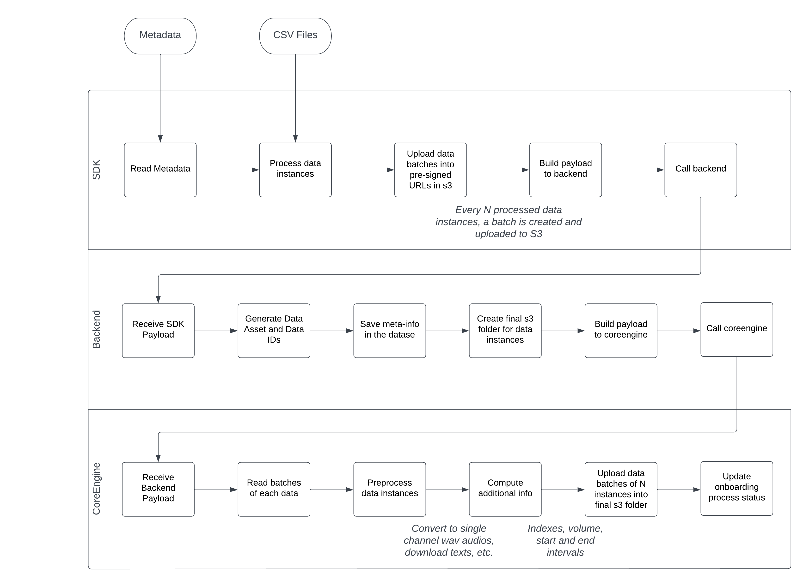

# Developer Guide

## Requirements

 - Install [Python](https://www.python.org/) 3.5+

## Installation
```
pip install -e .
```

## Running Tests

### Setup Environment

```
cp .env.example .env
```

Populate values in ```.env``` for pytest consumption.

### Run ```pytest```

```
pytest
```

## Data Asset Onboard

The image below depicts the onboard process of a data asset (e.g. corpora and datasets):

