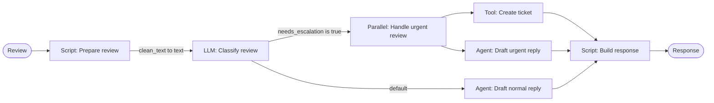

# RFC: Static Graph Support for Agents

**Status**: Draft
**Created**: 2026-07-30

## Summary

Expose the agent engine's static-graph runtime through the aiXplain v2 SDK and platform backend. Users will be able
to define agents with explicit nodes, edges, conditions, and parameter mappings.

The same graph representation will provide a migration path for executing legacy Pipelines on the agent engine,
allowing the legacy Pipeline runtime to be retired gradually.

## Motivation and Problem Statement

aiXplain currently supports legacy Pipelines for deterministic, graph-based workflows. The agent engine already
provides a static-graph runtime capable of executing equivalent and more advanced workflows, but this runtime is not
exposed through the v2 SDK or platform backend.

The SDK currently represents structured agent execution using Tasks and dependencies. This supports basic ordered
execution but cannot express different node types, conditional routing, parameter mappings, parallel branches, or
other graph behavior.

Consequently, users cannot define, save, retrieve, or run full static graphs through the platform.

## Goals

- Allow v2 SDK users to define a static graph and attach it to an Agent.
- Allow users to save, retrieve, update, and execute an Agent while preserving its complete graph definition.
- Support graph behavior including typed nodes, conditional routing, parallel execution, cycles, and parameter
  mapping between nodes.
- Preserve existing legacy Pipeline behavior by translating Pipeline definitions into agent-engine graphs internally.
- Support structured and non-text values between nodes without converting them unnecessarily to strings.
- Provide validation that rejects malformed or unexecutable graph definitions with clear error messages.

## Non-goals

- Rebuilding or replacing the existing visual Pipeline designer as part of this RFC.
- Immediately removing the legacy Pipeline engine before compatibility has been verified.
- Changing the behavior of agents that use dynamic planning rather than a static graph.
- Guaranteeing byte-for-byte identical text from nondeterministic models when comparing legacy and graph execution.

## Terminology

- **Static graph:** A workflow whose possible nodes and connections are defined before execution. Runtime values may
  still select different paths through conditions or cycles.
- **Node:** One executable operation in a graph, such as a model call, tool call, script, agent, condition, parallel
  operation, or subgraph.
- **Edge:** A directed connection that determines which node may execute after another node. An edge may include a
  condition and parameter mappings.
- **Task:** The existing SDK representation of work assigned to an agent, described through instructions, expected
  output, and dependencies. A Task is not a general-purpose graph node.
- **State:** The shared collection of typed values that nodes read from and write to during graph execution.
- **Parameter mapping:** A declaration mapping a source node's output or state value to a target node's expected input.
- **Conditional edge:** An edge followed only when its condition matches the current graph state.

## Current Behavior

### SDK

The v2 SDK supports structured agent execution through `Task` objects. Tasks can declare dependencies, allowing basic
sequences such as:

`Task A -> Task B -> Task C`

The SDK cannot currently represent typed graph nodes, conditional edges, parameter mappings, parallel branches,
cycles, or an explicit static-graph execution strategy.

### Platform Backend

The backend stores Tasks and their dependencies on an Agent, but it does not store a graph document. Consequently, it
cannot return a graph when an Agent is fetched or forward one to the agent engine during execution.

### Agent Engine

The agent engine already has a static-graph runtime supporting multiple node types, conditions, parallel execution,
cycles, and graph serialization.

However, platform requests cannot provide this graph directly. When the engine receives Tasks without a planner, it
converts them into a basic chain of agent or model nodes. This conversion loses the richer behavior available in the
graph runtime.

### Legacy Pipelines

Legacy Pipelines already represent deterministic workflows using nodes, links, routing conditions, parameter
mappings, and typed inputs and outputs. They are executed by the legacy Core Engine rather than the agent engine.

## Proposed Design

The platform will use one shared graph document as the contract between the SDK, platform backend, and agent engine.

For SDK-created graphs:

1. A user defines nodes, edges, an entry point, conditions, and parameter mappings through the v2 SDK.
2. The SDK validates and serializes the graph as part of an Agent payload.
3. The platform backend validates and stores the graph without removing graph-specific information.
4. When the Agent runs, the backend forwards the graph document to the agent engine.
5. The agent engine deserializes the inline graph and executes it using its existing static-graph strategy.
6. Execution steps identify the nodes and routes taken.

Legacy Pipeline definitions will be translated into the same graph document, allowing them to use the same runtime
while preserving their existing external API during migration.

### SDK API

The v2 SDK will expose typed classes for constructing a graph. Edges will accept node objects so users do not need to
manually manage node IDs. The SDK will generate a unique internal ID for each node when one is not supplied. Advanced
users may provide `node_id` explicitly when they need stable identifiers in serialized documents and execution traces.

A node's graph ID is separate from the identifier of the component it executes. For example, two nodes may execute the
same model while retaining different node IDs, configurations, connections, and trace entries. Component identifiers
such as `tool_id`, `agent_id`, and `script_id` are required. An `LLMNode` may omit `model_id` to inherit the Agent's
default LLM; the effective model ID must be resolved before the graph reaches the agent engine.

The following example contains scripts, an LLM, a routing decision, parallel execution, a tool, and sub-agents:

```python
from aixplain.v2 import Agent
from aixplain.v2.graph import (
    AgentNode,
    Condition,
    Edge,
    Graph,
    LLMNode,
    ParallelNode,
    ScriptNode,
    ToolNode,
)

prepare = ScriptNode(
    name="Prepare review",
    script_id="prepare-script-id",
    inputs=["review"],
    outputs=["clean_text"],
)

classify = LLMNode(
    name="Classify review",
    prompt="Analyze this review: {{text}}",
    inputs=["text"],
    outputs=["analysis", "needs_escalation"],
    # Uses the Agent's default LLM.
)

create_ticket = ToolNode(
    name="Create support ticket",
    tool_id="ticket-tool-id",
    inputs=["review"],
    outputs=["ticket"],
)

draft_urgent_reply = AgentNode(
    name="Draft urgent reply",
    agent_id="support-agent-id",
    inputs=["review"],
    outputs=["reply"],
)

handle_urgent = ParallelNode(
    name="Handle urgent review",
    nodes=[create_ticket, draft_urgent_reply],
    merge_strategy="collect",
)

draft_normal_reply = AgentNode(
    name="Draft normal reply",
    agent_id="support-agent-id",
    inputs=["review"],
    outputs=["reply"],
)

finalize = ScriptNode(
    name="Build response",
    script_id="response-script-id",
    inputs=["reply", "ticket"],
    outputs=["response"],
)

graph = Graph(
    entry_point=prepare,
    nodes=[
        prepare,
        classify,
        create_ticket,
        draft_urgent_reply,
        handle_urgent,
        draft_normal_reply,
        finalize,
    ],
    edges=[
        Edge(
            source=prepare,
            target=classify,
            parameter_mapping={"clean_text": "text"},
        ),
        Edge(
            source=classify,
            target=handle_urgent,
            condition=Condition.is_true("needs_escalation"),
        ),
        Edge(
            source=classify,
            target=draft_normal_reply,
            condition=Condition.is_default(),
        ),
        Edge(
            source=handle_urgent,
            target=finalize,
            parameter_mapping={"reply": "reply", "ticket": "ticket"},
        ),
        Edge(
            source=draft_normal_reply,
            target=finalize,
            parameter_mapping={"reply": "reply"},
        ),
    ],
)

agent = Agent(name="Review handler", graph=graph)
agent.save()

result = agent.run({"review": "The product broke and damaged my desk."})
```

The resulting graph is:



The SDK will infer `strategy="static_graph"` when an Agent has a graph and include the strategy explicitly in the wire
payload. Edges will own parameter mappings. During construction, the SDK will verify mappings against the source
node's outputs and target node's inputs when their schemas are locally available. The backend and engine will perform
authoritative validation before persistence and execution.

### Conditions and Routing

Nodes write their outputs into graph state. Conditional edges inspect those state values to choose the next node. A
condition does not invoke a model or script; a preceding node is responsible for producing the value that the
condition reads.

The SDK will provide a typed `Condition` API rather than requiring users to write condition strings directly:

```python
Condition.is_true("needs_escalation")
Condition.is_false("needs_escalation")
Condition.equals("sentiment", "negative")
Condition.not_equals("status", "resolved")
Condition.contains("categories", "safety")
Condition.greater_than("confidence", 0.8)
Condition.exists("ticket_id")
Condition.is_default()
```

For example, if an LLM, tool, or script writes `needs_escalation=True` into state, routing can be declared as:

```python
Edge(
    source=classify,
    target=handle_urgent,
    condition=Condition.is_true("needs_escalation"),
)
Edge(
    source=classify,
    target=draft_normal_reply,
    condition=Condition.is_default(),
)
```

The default edge is selected only if no preceding condition from the same source node matches. Validation will reject
multiple default edges from the same source and ambiguous combinations where deterministic ordering cannot be
guaranteed.

The canonical wire representation will identify the state key, operator, and optional comparison value explicitly:

```json
{
  "source": "classify-review-id",
  "target": "handle-urgent-id",
  "condition": {
    "key": "needs_escalation",
    "operator": "isTrue"
  }
}
```

`aixplain-agents` currently supports the smaller string DSL `key`, `!key`, and `key=value`. Its condition parser will
be extended to accept the canonical structured representation and the additional legacy Pipeline operations required
for compatibility, including inequality, membership, containment, and numeric comparisons. The existing string DSL
will remain supported for backward compatibility.

### Graph Wire Format

The SDK, platform backend, and `aixplain-agents` will share a versioned JSON graph document. The public API boundary
uses camelCase, consistent with the existing v2 API. The SDK and engine may use snake_case internally.

The following is a representative excerpt; the complete document contains every node from the SDK example above:

```json
{
  "strategy": {
    "type": "static_graph"
  },
  "graph": {
    "version": "1",
    "entryPoint": "prepare-review",
    "allowCycles": false,
    "maxLoopIterations": null,
    "inputs": [
      {
        "name": "review",
        "dataType": "text",
        "required": true
      }
    ],
    "outputs": [
      {
        "name": "response",
        "dataType": "json"
      }
    ],
    "nodes": {
      "prepare-review": {
        "id": "prepare-review",
        "type": "script",
        "name": "Prepare review",
        "scriptId": "prepare-script-id",
        "inputs": [
          {
            "name": "review",
            "dataType": "text"
          }
        ],
        "outputs": [
          {
            "name": "clean_text",
            "dataType": "text"
          }
        ]
      },
      "classify-review": {
        "id": "classify-review",
        "type": "llm",
        "name": "Classify review",
        "modelId": "default-model-id",
        "prompt": "Analyze this review: {{text}}",
        "inputs": [
          {
            "name": "text",
            "dataType": "text"
          }
        ],
        "outputs": [
          {
            "name": "analysis",
            "dataType": "text"
          },
          {
            "name": "needs_escalation",
            "dataType": "boolean"
          }
        ]
      },
      "handle-urgent": {
        "id": "handle-urgent",
        "type": "parallel",
        "name": "Handle urgent review",
        "nodeIds": [
          "create-ticket",
          "draft-urgent-reply"
        ],
        "mergeStrategy": "collect"
      },
      "create-ticket": {
        "id": "create-ticket",
        "type": "tool",
        "name": "Create support ticket",
        "toolId": "ticket-tool-id",
        "inputs": [
          {
            "name": "review",
            "dataType": "text"
          }
        ],
        "outputs": [
          {
            "name": "ticket",
            "dataType": "json"
          }
        ]
      },
      "draft-urgent-reply": {
        "id": "draft-urgent-reply",
        "type": "agent",
        "name": "Draft urgent reply",
        "agentId": "support-agent-id",
        "inputs": [
          {
            "name": "review",
            "dataType": "text"
          }
        ],
        "outputs": [
          {
            "name": "reply",
            "dataType": "text"
          }
        ]
      }
    },
    "edges": [
      {
        "source": "prepare-review",
        "target": "classify-review",
        "parameterMapping": {
          "clean_text": "text"
        }
      },
      {
        "source": "classify-review",
        "target": "handle-urgent",
        "condition": {
          "key": "needs_escalation",
          "operator": "isTrue"
        }
      },
      {
        "source": "classify-review",
        "target": "draft-normal-reply",
        "condition": {
          "operator": "default"
        }
      }
    ]
  }
}
```

The contract makes the following choices:

- `version` allows the graph document to evolve without silently changing old definitions.
- `strategy.type` uses the engine's existing `static_graph` strategy value.
- `nodes` is keyed by node ID, matching the engine's current `Graph` representation.
- The SDK accepts node objects but serializes edge endpoints and parallel children as IDs.
- Component references use explicit `modelId`, `toolId`, `agentId`, and `scriptId` fields.
- Graph and node input/output declarations carry data types and enable parameter-mapping validation.
- Conditions contain portable data and never contain Python callables or import paths.
- `parameterMapping` maps a source output name to a target input name.
- `allowCycles` and `maxLoopIterations` expose the engine's existing loop controls.
- Graph-level inputs and outputs define the public contract used when running the Agent.

The engine currently accepts a graph only through `strategy.graph_file`, or constructs a basic graph from Tasks. The
engine `AgentDefinition` and payload adapter will be extended to accept this inline `graph` document. Internally, the
engine will convert camelCase fields to its existing snake_case graph models and resolve platform component IDs to
runtime models, tools, scripts, and agents.

### Graph Validation

Validation occurs at all three system layers because each layer has access to different information.

#### SDK Validation

The SDK validates the graph while the user constructs it:

- Node IDs must be unique and the entry point must reference an existing node.
- Edge sources and targets, and the children of parallel nodes, must reference existing nodes.
- Input and output names must be unique within a node.
- Parameter mappings must reference declared source outputs and target inputs with compatible data types.
- Every executable node must be reachable from the entry point.
- Each node must provide the component reference required by its type, except an `LLMNode` may inherit the Agent's
  default model.
- A graph containing cycles must set `allowCycles` and define `maxLoopIterations`.
- Multiple unconditional outgoing edges are rejected; explicit parallel execution uses a `ParallelNode`.
- A source node may have no more than one default edge.

When multiple conditional edges leave the same node, the engine evaluates them in their declared order and follows
the first matching edge. The default edge is followed only when none of the other conditions match. For example:

```python
Edge(
    source=classify,
    target=high_score,
    condition=Condition.greater_than("score", 0.8),
)
Edge(
    source=classify,
    target=medium_score,
    condition=Condition.greater_than("score", 0.5),
)
Edge(
    source=classify,
    target=low_score,
    condition=Condition.is_default(),
)
```

For `score=0.9`, both numeric conditions match, so the first edge selects `high_score`. For `score=0.6`, only the
second condition matches and selects `medium_score`. If neither condition matches, the default edge selects
`low_score`.

#### Backend Validation

The backend repeats structural validation because API callers may bypass the SDK. It also validates platform data
that may not be available locally:

- Referenced models, tools, scripts, and agents must exist and be accessible to the requesting team.
- Component input and output schemas must agree with the schemas declared by their nodes.
- The graph format version must be supported.
- Graph size and complexity must stay within platform limits.
- Stored scripts and referenced URLs must satisfy platform security rules.

#### Engine Validation

The engine performs final runtime validation:

- Every node type and condition must deserialize successfully.
- Required runtime components must resolve.
- The graph must compile and all parameter mappings must be executable.
- Cycle, iteration, timeout, and parallelism limits must be enforceable.
- Required inputs must be available before a node runs.
- Node outputs must match their declared types.

### Error Propagation

Graph validation and execution errors must travel through every layer without losing their structured context:

```text
aixplain-agents error -> platform backend -> v2 SDK exception
```

The shared error shape will include a stable code, human-readable message, and relevant graph context:

```json
{
  "code": "GRAPH_PARAMETER_MAPPING_ERROR",
  "message": "Output 'result' does not match input 'text'.",
  "nodeId": "classify-review",
  "edge": {
    "source": "prepare-review",
    "target": "classify-review"
  },
  "executionId": "execution-id",
  "retryable": false
}
```

- Invalid SDK construction raises a graph-validation exception immediately.
- Invalid save or update requests return a structured backend `4xx` response.
- Engine execution failures identify the failing node, edge when applicable, execution ID, and whether retrying is
  appropriate.
- The backend preserves the engine's error code and details instead of replacing them with a generic message.
- The SDK converts backend errors into the existing aiXplain custom exception hierarchy while retaining structured
  graph fields for programmatic inspection.
- Credentials, secrets, signed URL parameters, and sensitive node values are redacted from errors and traces.

### Platform Backend

The platform backend will accept `strategy` and `graph` on the v2 Agent create and update inputs. It will validate the
document before persistence and return the complete graph when the Agent is fetched, allowing the SDK to reconstruct
the same typed graph objects.

During a run, `AgentRunService.buildAgentPayload()` will resolve the stored graph and forward both fields to
`aixplain-agents`:

```json
{
  "strategy": {
    "type": "static_graph"
  },
  "graph": {
    "version": "1",
    "entryPoint": "prepare-review",
    "nodes": {},
    "edges": []
  }
}
```

The current hardcoded `links: []` field remains for compatibility with old payload consumers but is not used as the
static-graph definition. The new `graph` field is authoritative for Agents using `strategy.type=static_graph`.

Before saving or running an Agent, the backend will collect all `modelId`, `toolId`, `scriptId`, and `agentId`
references from the graph. It will verify that the resources exist and that the requesting team is allowed to use
them. This extends the access checks already performed for Agent assets and sub-agents.

The backend will also:

- Reject unsupported graph versions, node types, conditions, mappings, and execution limits.
- Preserve node and edge ordering where ordering affects conditional evaluation.
- Include the graph in Agent response DTOs and avoid dropping unknown graph fields during create/update conversion.
- Resolve an omitted LLM node `modelId` to the Agent's default `llmId` before sending the graph to the engine.
- Forward structured engine errors and graph trace information without replacing them with generic errors.

#### Graph Storage Options

Graph ownership remains an open question. The backend can support either of the following designs:

1. **Agent-owned graph:** Store the complete document in `agent.graph`. Creating, updating, fetching, or deleting the
   Agent performs the corresponding operation on its graph. This is the simpler model and makes Agent round trips
   atomic.
2. **Independent Graph resource:** Store a `graphId` on the Agent and persist the document in a separate Graph
   collection. The backend loads the referenced Graph when building the run payload. This permits graph reuse and an
   independent Graph lifecycle, but requires additional APIs, authorization, versioning, and deletion rules.

After the backend resolves the graph document, validation and execution are identical for both storage models.

### `aixplain-agents` Engine

This proposal does not introduce a new graph executor. It exposes the existing executor through an inline,
platform-compatible graph contract and adds only the missing adapter and compatibility behavior.

#### Inline Graph Input

`AgentDefinition` and `PayloadAdapter` will accept an inline graph in addition to the two existing static-graph paths:

```python
if definition.graph:
    graph = Graph.from_dict(definition.graph)
elif strategy.graph_file:
    graph = Graph.from_file(strategy.graph_file)
else:
    graph = build_graph_from_tasks(definition)
```

When the payload contains `strategy.type=static_graph`, the adapter will compile the resolved graph and construct the
existing `StaticGraphStrategy`. No new execution strategy or graph scheduler is introduced.

#### Component Resolution

The adapter already translates platform assets into runtime objects. That mechanism will be extended to resolve graph
`modelId`, `toolId`, `agentId`, and `scriptId` references into the model providers, tool registry entries, sub-agents,
and script wrappers expected by the existing node implementations.

#### Edge Parameter Mapping

Before a target node executes, the static strategy will apply the selected edge's `parameterMapping`. Each mapped
source output is assigned to the target input without converting the value to a string. Missing required values and
incompatible types produce structured graph errors identifying the edge and target node.

#### Conditions

The existing condition evaluation flow and first-matching-edge behavior remain in place. The condition parser will
add support for the structured, serializable condition representation used by the platform and the additional
operators required for legacy Pipeline compatibility. Existing string DSL conditions remain valid.

#### State and Tracing

The current shared `dict[str, Any]` state, loop handling, parallel execution, graph compilation, and node execution
remain unchanged. Existing execution steps will be reused. Mapping details and the selected outgoing edge will be
added to trace metadata only where the current trace does not already expose enough information to verify graph
execution.

### Legacy Pipeline Translation

| Legacy Pipeline concept | Agent graph equivalent |
|---|---|
| `INPUT` | Initial graph state / graph inputs |
| `OUTPUT` | Graph outputs read from final state |
| AI `ASSET` | `LLMNode` or `ToolNode`, depending on asset type |
| `SCRIPT` | `ScriptNode` using the legacy file execution wrapper |
| `ROUTER` / `DECISION` | Conditional edges, optionally a `ConditionalNode` |
| `SEGMENTOR` | Fan-out using a `ParallelNode` |
| `RECONSTRUCTOR` | Fan-in using `ParallelNode(mergeStrategy="collect")` or a script |
| `METRIC` | `ToolNode` |
| Pipeline link | Graph `Edge` |
| `paramMapping` | Edge `parameterMapping` |
| Route operation | Structured `Condition` |
| Typed parameter | Typed node input/output |
| Script `fileId` | `scriptId` resolved by the platform |
| `is_url: true` segment | Typed URL/reference value |

The translator preserves existing Pipeline definitions while producing the same graph document used by new
SDK-created Agents.

### Typed and Non-text Data

Nodes can produce text, numbers, booleans, lists, JSON objects, images, audio, video, and files. A downstream node must
receive the original type rather than a string representation of that value.

Small values travel inline using a typed envelope:

```json
{
  "value": {
    "sentiment": "negative",
    "confidence": 0.95
  },
  "dataType": "json"
}
```

Binary or large values travel by storage reference rather than being copied between nodes:

```json
{
  "url": "https://storage.example.com/audio.wav",
  "dataType": "audio"
}
```

Scripts and tools receive the value or reference without string conversion. String conversion occurs only when a
value enters an LLM prompt, such as `prompt="Analyze this: {{result}}"`. This also provides the compatibility model for
legacy Pipeline script segments: `is_url: true` becomes a typed URL/reference value.

## Compatibility and Migration

Existing Pipeline users continue using the current API without changing their code:

```python
pipeline = PipelineFactory.get("pipeline-id")
result = pipeline.run({"text": "I love this product"})
```

Internally, the platform translates the stored Pipeline definition into the shared graph format and executes the
resulting static-graph Agent through `agent.run()`. Existing Task-based and dynamically planned Agents continue using
their current execution paths.

## Security and Execution Limits

- Platform-hosted scripts execute through an isolated wrapper with time, memory, file, and network limits.
- URL inputs are restricted to supported schemes and protected against access to internal services; signed URL query
  parameters are redacted from logs and errors.
- Graph size, node count, nesting depth, total runtime, retries, and parallel concurrency are limited by the platform.
- Cycles require `allowCycles=true` and a finite `maxLoopIterations` value.
- Component access is checked both when the graph is saved and when it runs, because permissions may change.
- Secrets and sensitive state values are never persisted in the graph document or exposed in traces.

## Observability

Existing Agent execution traces will identify the graph version, node ID and type, execution order, selected outgoing
edge, retry or loop iteration, duration, and final status. Mapping metadata may include parameter names and data types,
but sensitive values are redacted. Graph errors use the structured error contract defined above so the SDK can expose
the failing node or edge to the user.

## Testing Strategy

### SDK

- Test construction and validation for every node, condition, mapping, cycle, and parallel configuration.
- Test save/get round trips so the retrieved Agent reconstructs the same graph document and typed SDK objects.
- Test camelCase wire serialization and snake_case Python fields.

### Backend

- Test create, update, get, delete, authorization, graph-version validation, and run-payload forwarding.
- Test both valid graphs and direct API requests that bypass SDK validation.
- Test that structured engine errors and traces reach the SDK without losing graph context.

### Engine

- Test inline graph deserialization and selection of the existing `StaticGraphStrategy`.
- Test parameter mappings with strings, numbers, booleans, lists, JSON, and URL references.
- Test conditional routing, default routes, parallel execution, cycles, limits, and component-resolution failures.

### Legacy Parity

Translate and execute the four supplied legacy exports:

- Sentiment segment, classify, and aggregate Pipeline.
- Watcher Matcher Pipeline.
- ODA merged Pipeline.
- Multi-LLM clustering Pipeline.

Compare deterministic values exactly. For nondeterministic model output, compare the output structure, selected route,
required fields, and equivalent behavior rather than requiring identical generated text.

## Rollout Plan

1. Finalize the shared graph and structured error schemas with version `1`.
2. Add the v2 SDK graph classes, validation, serialization, and round-trip tests behind a feature flag.
3. Add backend validation, persistence, retrieval, authorization, and run-payload forwarding.
4. Add minimal engine support for inline graphs, component resolution, parameter mapping, and structured conditions.
5. Enable static-graph Agent creation for selected teams and monitor validation and execution failures.
6. Add the legacy translator and run the four parity suites while the Core Engine remains available as a fallback.
7. Gradually route legacy Pipeline executions to `aixplain-agents`.
8. Retire the legacy execution path only after parity and operational targets are met for an agreed observation period.

## Alternatives Considered

| Alternative | Decision |
|---|---|
| Extend `Task` into every graph node type | Rejected because Task describes agent-assigned work and does not naturally represent scripts, conditions, or parallel control. |
| Create a new graph executor | Rejected because `aixplain-agents` already provides the required static-graph runtime. |
| Keep using the legacy Core Engine indefinitely | Rejected because it maintains two deterministic workflow runtimes and prevents Pipeline retirement. |
| Expose raw engine condition callables/import paths | Rejected because persisted platform documents require safe, portable JSON. |
| Translate Pipelines in each client SDK | Rejected because behavior would diverge across clients and older clients could not migrate transparently. |
| Agent-owned versus independent Graph storage | Undecided; both options are documented under Platform Backend. |

## Risks and Mitigations

| Risk | Mitigation |
|---|---|
| Legacy behavior differs after translation | Maintain Core Engine fallback during parity testing and staged rollout. |
| Cycles or parallel branches consume excessive resources | Enforce iteration, duration, graph-size, and concurrency limits. |
| Component schemas change after save | Revalidate references, permissions, and schemas at run time. |
| Large or binary state causes memory growth | Pass large data by typed URL reference and cap inline value size. |
| Sensitive data appears in traces | Redact values, credentials, and signed URL parameters at every layer. |
| New graph fields are lost between services | Add contract and save/get round-trip tests across all three repositories. |

## Success Criteria

- A v2 SDK user can define, validate, save, retrieve, update, and run a static graph containing supported node types,
  conditions, parameter mappings, parallel branches, and bounded cycles.
- Fetching an Agent reconstructs a graph equivalent to the document originally saved.
- Execution traces show the declared nodes and selected routes.
- All four supplied legacy Pipeline exports translate and run end to end with equivalent behavior and outputs.
- JSON and URL/file values reach downstream scripts and tools with their types preserved.
- Validation and execution failures reach the SDK as structured aiXplain exceptions identifying the relevant node or
  edge.
- Existing dynamic Agents, Task-based Agents, and Pipeline client calls remain backward compatible during migration.

## Open Questions

- Is a graph stored as part of an Agent, or is it an independently stored platform resource that Agents reference by
  `graphId`?
- What initial graph-size, nesting, loop, duration, and parallel-concurrency limits should the platform enforce?
- Which component schemas can the SDK validate locally, and which require backend lookup?
- Should the backend persist an LLM node's inherited model ID into the graph, or resolve it only in the run payload?
- What parity and observation-period thresholds must be met before removing the Core Engine fallback?

## Key Code References

- SDK: `aixplain/v2/agent.py` and the proposed `aixplain/v2/graph/` package.
- Backend: `src/agent/models/mongodb/agent.entity.ts`, `src/agent/inputs/agentv2.input.ts`, and
  `src/agent/services/agent.run.service.ts`.
- Engine: `aixplain_agents/graph/`, `aixplain_agents/definition.py`, `aixplain_agents/definition_helpers.py`, and
  `aixplain_agents/adapter/payload_adapter.py`.
- Legacy Pipeline SDK: `aixplain/v1/modules/pipeline/designer/`.
