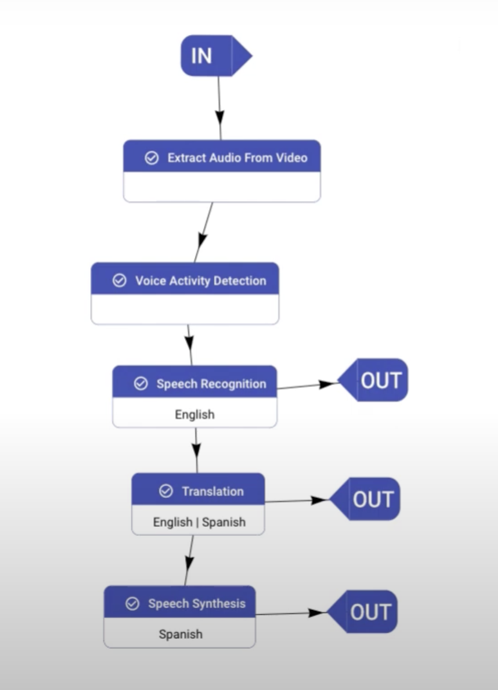

# Video Subtitling Example

The code in `subtitle_generator.py` subtitles a video spoken one source language to a target language and generates an srt file as an output.

In this example pipeline, the pipeline receives an English video as input and first extracts its audio, which is then fed to a VAD node, responsible to find the voice activity segments of the audio input. These segments are then transcribed by a speech recognition node and then translated into Spanish by a translation English-Spanish node. Finally, a speech synthesis node is added to dub the Spanish translation.



## Run the Example

### Build a Pipeline using aiXplain

In order to build a subtitle generation pipeline, you need to log in to [aiXplain platform](https://platform.aixplain.com/) and use the web UI for designing pipelines.

### Run Code

Generate a http(s) link to your video file to subtitle.
Using the pipeline id generated for subtitling in the step above, run the code:

```
python3 subtitle_generator.py --video-pt-path <http_link_to_video> \
                                --srt-path pt.srt
                                -k <PIPELINE_ID>
```

### Sample Output

You can refer to a sample output in this [file](../../assets/subtitle-generator-output.json).
