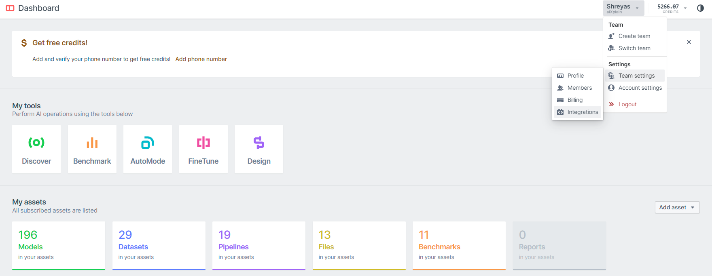

# Team API Key Guide
[Sign up](https://platform.aixplain.com/register) or [login](https://platform.aixplain.com/login) for an account on aiXplain. Then from the Dashboard, navigate to the [Integrations](https://platform.aixplain.com/account/integrations).

Please refer to the image below.

### Creating a New API Key
On the **Integrations** page, you can find the **Create a team access key** button on the top right corner. You can create a new key by clicking that button, then specifiying a label and an (optional) expiry date.

### Manage API Keys
On the **Integrations** page, you can view all the existing Team API keys. You can also delete keys on this page.
