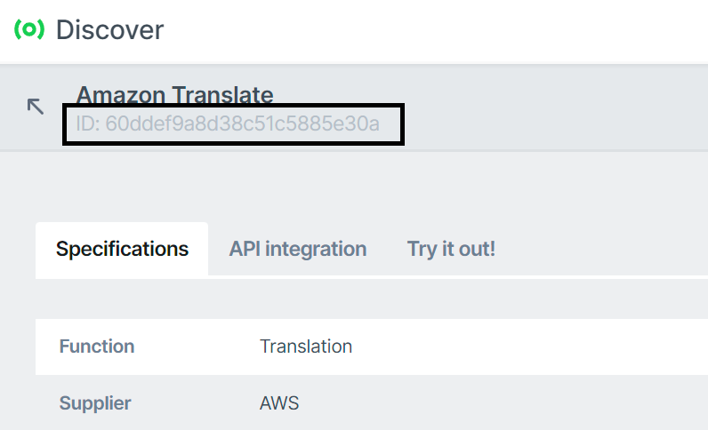

# User Documentation
aiXplain has a vast repository of multiple assets such as models, corpus, datasets, metrics, pipelines, and more. The factories in aiXplain SDK provide a powerful set of tools for creating, searching, and managing these assets.

The assets and services currently supported by the SDK are:
#### Assets
- [Model](#models)
- [Pipeline](#pipelines)
- [Corpus](#corpus)
- [Dataset](#datasets)
- [Metric](#metrics)
- [File](#file)
#### Services
- [Benchmark](#benchmark)
- [FineTune](#finetune)

## Models
aiXplain has an ever-expanding catalog of 35,000+ ready-to-use AI models to be used for various tasks like Translation, Speech Recognition, Diacritization, Sentiment Analysis, and much more.

### Explore
There are two ways to explore our model repository:

*1. Through the UI:*

The catalog of all available models on aiXplain can be accessed and browsed [here](https://platform.aixplain.com/discovery/models). Details of each model can be found by clicking on the model card. Model ID can be found on the URL or below the model name.

Please refer to the image below.



Once the Model ID of the desired model is available, it can be used to create a `Model` object from the `ModelFactory`.
```python
from aixplain.factories import ModelFactory
model = ModelFactory.get(<MODEL_ID>) 
```

*2. Through the SDK:*

If you need, the aixplain SDK allows searching for existing models that match a specific criteria. `ModelFactory` can search for machine learning models that perform a particular task and optionally support a specific input/output language pair.

```python
from aixplain.factories import ModelFactory
from aixplain.enums import Function, Language
model_list = ModelFactory.list(function=Function.TRANSLATION, source_languages=Language.English, target_languages=Language.French)["results"]
```

### Run
The aixplain SDK allows you to run machine learning models synchronously or asynchronously, depending on your use case. This flexibility allows you to choose the most appropriate mode of execution based on your application's requirements.

```python
# Run Synchronously
translation = model.run("This is a sample text") # You can use a URL or a file path on your local machine

# Run Asynchronously
## Start async job
start_response = model.run_async("This is a sample text")
poll_url = start_response["url"]
## Poll to see current job status
poll_response = model.poll(poll_url)
```

You may also set special parameters for Large Language Models in the platform.

```python
from aixplain.factories import ModelFactory
from aixplain.enums import Function
model = ModelFactory.list(query="GPT-4o", function=Function.TEXT_GENERATION)["results"][0]
response = model.run(
    data="What is my name?", # last utterance
    context="Always assist with care, respect, and truth. Respond with utmost utility yet securely. Avoid harmful, unethical, prejudiced, or negative content. Ensure replies promote fairness and positivity.", # system prompt
    history=[
        { "role": "user", "content": "Hello! My name is James." },
        { "role": "assistant", "content": "Hello!" }
    ], # conversation history,
    temperature=0.7
)
```

### Deploying Hugging Face Large Language Models

You can deploy your very own Hugging Face large language models on our platform using the aiXplain SDK:
```console
$ aixplain onboard hf-model --name <what you'd like to name your model> --hf-repo-id <Hugging Face repository ID ({supplier}/{name})> --revision <revision-hash> --hf-token <Hugging Face token> [--api-key <TEAM_API_KEY>]
```
This command will return your model's ID. The on-boarding process will take 5 to 15 minutes, during which you can check the on-boarding status by running the following:
```console
$ aixplain get hf-model-status --model-id <model ID> [--api-key <TEAM_API_KEY>]
```

Once the on-boarding process has completed, you can use this newly-deployed large language model just like any other private model on our platform. Note that our platform currently only supports language models up 7 billion parameters in size (~30 GB), so any attempts to deploy larger models will result in an error message.

### Uploading Models
## Uploading Models
In addition to exploring and running models, the aiXplain SDK allows you to upload your own models to the aiXplain platform. This requires a working model image in line with the template specified [here](https://github.com/aixplain/model-interfaces/blob/main/docs/user/model_setup.md). [These](https://github.com/aixplain/model-interfaces/tree/main) are the interfaces with which you will be working. You will also be required to have an aiXplain account as well as a TEAM_API_KEY which should be set either as an environment variable or passed into each of the following functions.

Note: For any of the CLI commands, running `aixplain [verb] [resource] --help` will display a description of each argument that should be passed into that command.

The `api-key` parameter is optional and is only used if the environment variable isn't set or you would like to override the existing environment variable.

Find a supported function type that best describes your model's purpose. Note down the function's ID.
```console
aixplain list functions [--verbose] [--api-key <TEAM_API_KEY>]
filteredFrom: 63
items:
- modalities:
  - text-number
  name: Object Detection
- modalities:
  - text-label
  name: Language Identification
- modalities:
  - image-text
  - document-text
  name: OCR
- modalities:
  - image-label
  name: Image Label Detection
- modalities:
  - image-text
  name: Image Captioning
...
```
`verbose` is optional and is set to False by default. Again, `api-key` is optional.

Once you have chosen a suitable host machine and function, register your model and create an image repository:

```console
aixplain create image-repo --name <model_name> --description <model_description> --function <function_name> --source-language <source_language> --input-modality <input_type> --output-modality <output_type> --documentation-url <information_url>  [--api-key <TEAM_API_KEY>]
{
    "repoName": <model_repository_name>,
    "modelId": <model_id>
}
```
`name` is your model's name. `description` should hold a short summary of your model's purpose. Specify the function name most closely describe your model's purpose in the `function` field. Finally, `source-language` should contain your model's source language.

This returns a model ID and a repository name. Next, obtain login credentials for the newly created repository:

```console
aixplain get image-repo-login [--api-key <TEAM_API_KEY>]
{
    "username": <username>,
    "password": <password>,
    "registry": <registry_url>
}
```

These credentials are valid for 12 hours, after which you must again log in for a fresh set of valid credentials. If you are using Docker, you can use these credentials to log in with the following:
```console
docker login --username $USERNAME --password $PASSWORD 535945872701.dkr.ecr.us-east-1.amazonaws.com
```

You must first build your image using the following:
```console
docker build . -t $REGISTRY/$REPO_NAME:<your-choice-of-tag>
```
where `<tag>` is some sort of descriptor (usually a version tag like v0.0.1) for your specific model.

Push the newly tagged image to the corresponding repository:
```console
$ docker push $REGISTRY/$REPO_NAME:<the-tag-you-chose>
```


Once this is done, onboard the model:
```console
$ aixplain onboard model --model-id <model_id> --image-tag <model_image_tag> --image-hash <model_image_hash> --host-machine <host_machine_code> [--api-key <TEAM_API_KEY>]
```
`model-id` should be the model ID returned by the image-create-repo function used earlier. `image-tag` should be set to whatever string you used to tag your model image. The image sha256 hash can be obtained by running `docker images --digests`. Choose the hash corresponding to the image you would like onboarded. `host-machine` should contain the machine code on which to host the model. A list of all the models can be obtained via `aixplain list gpus` as follow:

Note down the host machines "code":
```console
aixplain list gpus [--api-key <TEAM_API_KEY>]
- - nvidia-t4-1
  - 'Price: 0.752'
  - 'Units: $/hr'
- - nvidia-a10g-1
  - 'Price: 1.006'
  - 'Units: $/hr'
- - nvidia-a10g-4
  - 'Price: 5.672'
  - 'Units: $/hr'
  ...
```

This will send an email to an aiXplain associate to finalize the onboarding process. 

## Pipelines
[Design](https://aixplain.com/platform/studio/) is aiXplain’s no-code AI pipeline builder tool that accelerates AI development by providing a seamless experience to build complex AI systems and deploy them within minutes. You can visit our platform and design your own custom pipeline [here](https://platform.aixplain.com/studio).

### Explore
There are two ways to find pipelines:

*1. Through the UI:*

The catalog of all your pipelines on aiXplain can be accessed and browsed [here](https://platform.aixplain.com/dashboard/pipelines). Details of the pipeline can be found by clicking on the pipeline card. Pipeline ID can be found from the URL or below the pipeline name (similar to models).

Once the Pipeline ID of the desired pipeline is available, it can be used to create a `Pipeline` object from the `PipelineFactory`. 
```python
from aixplain.factories import PipelineFactory
pipeline = PipelineFactory.get(<PIPELINE_ID>) 
```

*2. Through the SDK:*

If you need, the aixplain SDK allows searching for existing pipelines. 

```python
from aixplain.factories import PipelineFactory
pipeline_list = PipelineFactory.get_first_k_assets(k=5)
```

### Run
The aixplain SDK allows you to run pipelines synchronously or asynchronously, depending on your use case. This flexibility allows you to choose the most appropriate mode of execution based on your application's requirements.

```python
# Run Synchronously
result = pipeline.run("This is a sample text")

# Run Asynchronously
## Start async job
start_response = pipeline.run_async("This is a sample text")
poll_url = start_response["url"]
## Poll to see current job status
poll_response = pipeline.poll(poll_url)
```

For multi-input pipelines, you can specify as input a dictionary where the keys are the label names of the input node and values are their corresponding content:

```python
# Run Synchronously
result = pipeline.run({ 
    "Input 1": "This is a sample text to input node 1.",
    "Input 2": "This is a sample text to input node 2."
})
```

### Process Data Assets

You can also process an aiXplain data asset, being a Corpus or a Dataset, using a pipeline. For this end, just specify the ID of the data asset and the ID of its corresponding data to be processed. For example:

```python
# Run Synchronously
result = pipeline.run(
    data_asset="64acbad666608858f693a39f",
    data="64acbad666608858f693a3a0"
)

# Run Asynchronously
## Start async job
start_response = pipeline.run_async(
    data_asset="64acbad666608858f693a39f",
    data="64acbad666608858f693a3a0"
)
poll_url = start_response["url"]
## Poll to see current job status
poll_response = pipeline.poll(poll_url)
```

## Corpus

aiXplain has an extensive collection of general-purpose corpora to be explored, processed and used to create task-specific datasets.

The aiXplain SDK allows searching for existing corpora that match a specific criteria. `CorpusFactory` can search for corpora that contain data from a particular language pair or data type.

```python
from aixplain.enums import DataType, Language
from aixplain.factories import CorpusFactory
corpus_list = CorpusFactory.list(page_size=5, language=Language.English, data_type=DataType.AUDIO)["results"]
```
Note: This does not download the resulted corpora to your local machine.

### Corpus Onboarding

Using the aiXplain SDK, you can also onboard your corpus into the aiXplain platform. A step-by-step example on how to do it can be accessed here:

[](https://colab.research.google.com/drive/1-FYTtyVaDxyVv7kGCaMEd5E3uiHYHRTt?usp=sharing) 

## Datasets
Different from corpus, a dataset is a representative sample of a specific phenomenon to a specific AI task. aiXplain also counts with an extensive collection of datasets for training, infer and benchmark various tasks like Translation, Speech Recognition, Diacritization, Sentiment Analysis, and much more.
You can even upload your own dataset [here](https://platform.aixplain.com/dashboard/datasets/upload).

The catalog of all available datasets on aiXplain can be accessed and browsed [here](https://platform.aixplain.com/discovery/datasets).

The aixplain SDK allows searching for existing datasets that match a specific criteria. `DatasetFactory` can search for datasets that are linked to a particular machine learning task and optionally support a specific input/output language pair.

```python
from aixplain.factories import DatasetFactory
from aixplain.enums import Function, Language
dataset_list = DatasetFactory.list(function=Function.TRANSLATION, source_languages=Language.English, target_languages=Language.French)["results"]
```
Note: This does not download datasets to your local machine.

### Dataset Onboarding

Using the aiXplain SDK, you can also onboard your dataset into the aiXplain platform. A step-by-step example on how to do it can be accessed here:
- Machine translation dataset:
  - [](https://colab.research.google.com/drive/1lkw_OW53PGaWE7Khj9JAM8V5y4LFZ8XB?usp=sharing) 


- Speech recognition dataset:
  - [](https://colab.research.google.com/drive/1f1NXHGxhIy0AAXnUZJB8QY3JLl-uC37e?usp=sharing) 

- Machine translation dataset directly from s3:
  - [](https://colab.research.google.com/drive/1Asnjeq5JQ9pV6UUQ2Z20XtrjnoaFD0nf?usp=sharing) 

- Image Label Detection Dataset:
  - [Link](../samples/label_dataset_onboarding/label_dataset_onboarding.ipynb)

## FineTune

[FineTune](https://aixplain.com/platform/finetune) allows you to customize models by tuning them using your data and enhancing their performance. Set up and start fine-tuning with a few lines of code. Once fine-tuning is complete, the model will be deployed into your assets, ready for you to use.

For now, we support the following tasks: `translation`, `search`, and `text-generation`. We have a guide for each task available on Google Colab:

- Translation:
  - [](https://colab.research.google.com/drive/1rVxxZpHzyP4FWn_Rd_j_g8tHU76S3rVT?usp=sharing)
- Search:
  - [](https://colab.research.google.com/drive/1W56VZuJPm0FilnvEvpo38T92XvZIGDUs?usp=sharing)
- Passthrough text generation (e.g. OpenAI ChatGPT 3.5):
  - [](https://colab.research.google.com/drive/1DeaOalATM2X9h0d7Uw4jOoT36WfB9nsB?usp=sharing)
- Hosted text generation (e.g. Llama 2 7B):
  - [](https://colab.research.google.com/drive/1IsZS6ilNi5jnMK4vhPy018oS37Wh1q3E?usp=sharing)

### Creating a FineTune


You can use the `FinetuneFactory` to create a FineTune object using the SDK. Here we show an example on how to fine-tune a translation model:

```python
from aixplain.factories import FinetuneFactory, DatasetFactory, ModelFactory
from aixplain.enums import Function, Language

# Choose 'exactly one' model
model = ModelFactory.list(function=Function.TRANSLATION, source_languages=Language.English, target_languages=Language.French, is_finetunable=True, page_size=1)["results"][0]
# Choose 'one or more' datasets
dataset_list = DatasetFactory.list(function=Function.TRANSLATION, source_languages=Language.English, target_languages=Language.French, page_size=1)["results"]

finetune = FinetuneFactory.create(<UNIQUE_NAME_OF_FINETUNE>, dataset_list, model)
```
You can visit [model](#models) and [dataset](#datasets) docs for more details.

Also, you can check the training, hosting and inference costs by running the following command:
```python
finetune.cost.to_dict()
```
```python
{
  'trainingCost': {
    'total': 0.1,
    'supplierCost': 0,
    'overheadCost': 0.1,
    'willRefundIfLowerThanMax': False,
    'totalVolume': 106.03,
    'unitPrice': 0
  },
  'inferenceCost': [
    {
      'unitPrice': 6e-05,
      'unitType': 'CHAR',
      'volume': 0
    }
  ],
  'hostingCost': {
    'currentMonthPrice': 0,
    'monthlyPrice': 0,
    'pricePerCycle': 0,
    'supplierBillingCycle': 'MONTH',
    'willRefundIfLowerThanMax': False
  }
}
```

### Starting a FineTune

Once a `FineTune` is created (refer to the [section above](#creating-a-finetune)), we need to call the start method:
```python
finetune_model = finetune.start()
```
We receive a model that we can check the fine-tuning info (status, epoch, training and validation losses):
 ```python
finetune_model_info = finetune_model.check_finetune_status()
epoch = finetune_model_info.epoch
training_loss = finetune_model_info.training_loss
validation_loss = finetune_model_info.validation_loss
```
Status can be one of the following: `onboarding`, `onboarded`, `hidden`, `training`, `deleted`, `enabling`, `disabled`, `failed`, `deleting`.

Once it is `onboarded`, you are ready to use it as any other model!


## Metrics
aiXplain has an impressive library of metrics for various machine learning tasks like Translation, Speech Recognition, Diacritization, and Sentiment Analysis. There are reference similarity metrics, human evaluation estimation metrics, and referenceless metrics.

The catalog of all available metrics on aiXplain can be accessed and browsed [here](https://platform.aixplain.com/discovery/metrics).

The aixplain SDK allows searching for existing metrics. `MetricFactory` can search for metrics for a particular machine learning task.

```python
from aixplain.factories import MetricFactory
metric_list = MetricFactory.list()['results']
```

### Run
The aixplain SDK allows you to run metrics. Some metrics might also require source or reference as inputs.
```python
output = metric.run(**{"hypothesis": "<sample hypothesis>", "source": "<sample optional source>", "reference": "<sample optional reference>"})
```
You can even pass a list of inputs in a single call.
```python
output = metric.run(**{"hypothesis": ["<sample hypothesis 1>", "<sample hypothesis 2>"], "source": ["<sample optional source 1>", "<sample optional source 2>"], "reference": ["<sample optional reference> 1", "<sample optional reference> 2"]})
```

## File

In the aiXplain SDK, the `FileFactory` provides functionality for uploading files to the aiXplain platform. This factory enables you to add custom datasets or resources that you want to work with in your AI tasks.

### Uploading Files

You can use the `FileFactory` to upload files to the aiXplain platform. This is achieved through the `create` function, which allows you to specify the local path of the file you want to upload, along with optional parameters such as tags, a license, and whether the file should be temporary. When uploading a file, you can set `is_temp` to `False` to indicate that the file is not temporary, meaning it will persist on the platform. Here's an example of how to upload a file:

```python
from aixplain.factories import FileFactory
from aixplain.enums import License
file_path = "/path/to/your/file.txt"
s3_link = FileFactory.create(
        local_path = filepath,
        tags = ['test1','test2'],
        license = License.MIT,
        is_temp = True
    )
```

By setting `is_temp` to `False`, you ensure that the uploaded file will not be automatically removed, and it will persist in the aiXplain platform for future use.

## Benchmark

[Benchmark](https://aixplain.com/platform/benchmark) is a powerful tool for benchmarking machine learning models and evaluating their performance on specific tasks. You can obtain easy-to-interpret granular insights on the performance of models for quality, latency, footprint, cost, and bias with our interactive Benchmark reports.

The proposed benchmarking framework is designed for being modular and interoperable in its core across three main components (models, datasets, metrics) in its body to become a one-stop shop for all possible benchmarking activities across several domains and metrics. You need to choose these three components for the task of your choice.

*Currently supported tasks are Translation, Speech Recognition, Diacritization, and Sentiment Analysis with many more in the works.*

### Creating a Benchmark
You can create a benchmarking job on aiXplain [here](https://platform.aixplain.com/benchmark) or you can also use the SDK. Let's see how we can use the `BenchmarkFactory` in the aixplain SDK for the same purpose.

```python
from aixplain.factories import BenchmarkFactory, DatasetFactory, MetricFactory, ModelFactory
from aixplain.enums import Function, Language

# Choose 'one or more' models
models = ModelFactory.list(function=Function.SPEECH_RECOGNITION, source_languages=Language.English_UNITED_STATES, page_size=2)['results']
# Choose 'one or more' metrics that are supported
metrics = MetricFactory.list(model_id=models[0].id, page_size=2)['results']
# Choose 'exactly one' dataset
datasets = DatasetFactory.list(function=Function.SPEECH_RECOGNITION, source_languages=Language.English_UNITED_STATES, page_size=1)['results']

benchmark = BenchmarkFactory.create(<UNIQUE_NAME_OF_BENCHMARK>, dataset_list=datasets, model_list=models, metric_list=metrics)
```

You can visit [model](#models), [dataset](#datasets), and [metric](#metrics) docs for more details.

### Running a Benchmark
Once a `Benchmark` is created (refer to the [section above](#creating-a-benchmark)), we need to start a new `BenchmarkJob` from it. It is really simple to run a benchmark:
```python
benchmark_job = benchmark.start()
```
Note: You can start multiple jobs on a single `Benchmark`.

### Getting the Results 
Once a `BenchmarkJob` is up and running (refer to the [section above](#running-a-benchmark)), we can check the status or directly download the current results as a CSV (even for an in-progress benchmarking job).
#### Status
```python
status = benchmark_job.check_status()
```
#### Results
```python
results_path = benchmark_job.download_results_as_csv()
```

### Adding Normalization To Your Benchmark
We have methods that specialize in handling text data from various languages, providing both general and tailored preprocessing techniques for each language's unique characteristics. These are called normalization options. The normalization process transforms raw text data into a standardized format, enabling a fair and exact evaluation of performance across diverse models. A few examples are 'removing numbers' and 'lowercase text'.
To get the list of supported normalization options, we need the metric and the model that we are going to use in benchmarking.
```python
supported_options = BenchmarkFactory.list_normalization_options(metric, model)
```
Note: These options can be different for each metric in the same benchmark

You have the flexibility to choose multiple normalization options for each performance metric. You can also opt for the same metric with varying sets of normalization options. This adaptability provides a thorough and comprehensive way to compare model performance.
```python
selected_options = [<option 1>....<option N>]
metric.add_normalization_options(selected_options)
```
You can even select multiple configurations for the same metric
```python
selected_options_config_1 = [<option 1>, <option 2>, <option 3>]
selected_options_config_2 = [<option 3>, <option 4>]
metric.add_normalization_options(selected_options_config_1)
metric.add_normalization_options(selected_options_config_2)
```
After this you can create the benchmark normally
```python
benchmark = BenchmarkFactory.create(<UNIQUE_NAME_OF_BENCHMARK>, dataset_list=datasets, model_list=models, metric_list=metrics_with_normalization)
```
